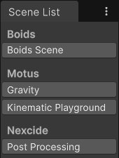

# Nexcide Tools
Various utilities for aiding development in Unity. Somewhat rough as they were not originally intended to be public.

## Cheeky Toolbar
Extends the main toolbar with 2 additional buttons.

- Fast play (Enter play mode without reloading scene or domain)
- Open C# Project (Same action as the option from the Assets menu)

## Easy Materials
A window dedicated to materials. List updates with each new selected GameObject containing a MeshRenderer. Open window
from menu: Nexcide > Easy Materials.

- Window can be locked to disable updating
- List can be saved to an asset file and then loaded
- Materials can be shown as icons or list
- Configuration from 'Nexcide/Easy Materials' in Project Settings

## ProBuilder Extensions
Extends functionality of ProBuilder. Open window from menu: Nexcide > ProBuilder Ext.

### Move Pivot 
When toggled on, a handle is displayed in the scene view to allow the user to move the pivot point of the selected mesh.
Toggle off to set new pivot position or click away to cancel.

### Reset Pivot
Useful in scenarios where vertices have been moved around and the pivot point is no longer even aligned with a vertex.
Reset the pivot point to the first vertex of the mesh.

### Reset Rotation
Reset the rotation of the transform of the GameObject whilst keeping the mesh in the same place.

### Face Paint Mode
When 'Update Color' is selected. The color is updated from the vertex colors of the mesh, if equals. When ProBuilder is
in 'Face Selection' mode and 'Face Paint Mode' is selected, right-clicking on face will change the vertex colors.

## Scene List
A window dedicated to scenes in the project. Open window from menu: Nexcide > Scene List.

- Use scenes from Build Settings or by searching through custom list of folders
- Click a scene to load it or right-click to select & highlight the scene in the Project window
- Optionally display folder labels
- Configuration from 'Nexcide/Scene List' in Project Settings

## Tile King
Procedurally generate a grid of tiles with randomization to break up repeating patterns. Create from GameObject menu: Nexcide > Tile King Mesh.

- Randomize materials
- Randomize vertex colors
- Randomize Rotation
- Randomize UVs
- Configuration from 'Nexcide/Tile King' in Project Settings
